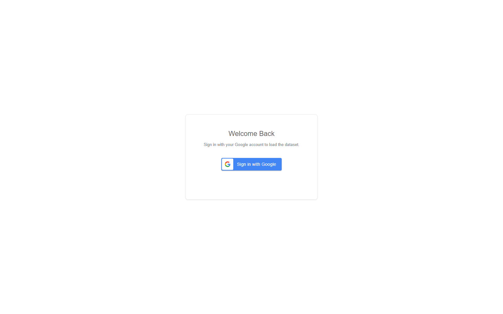
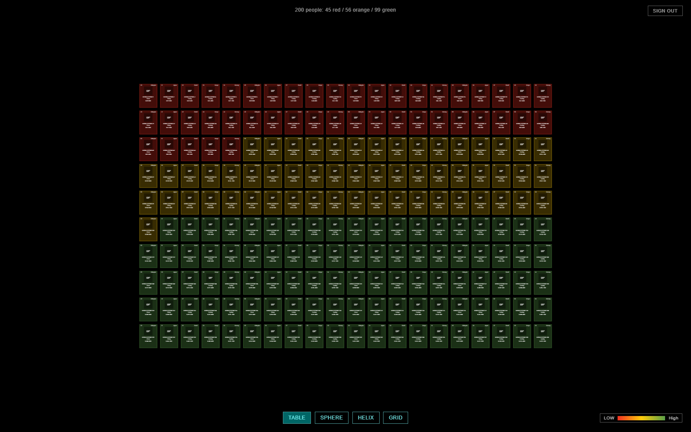
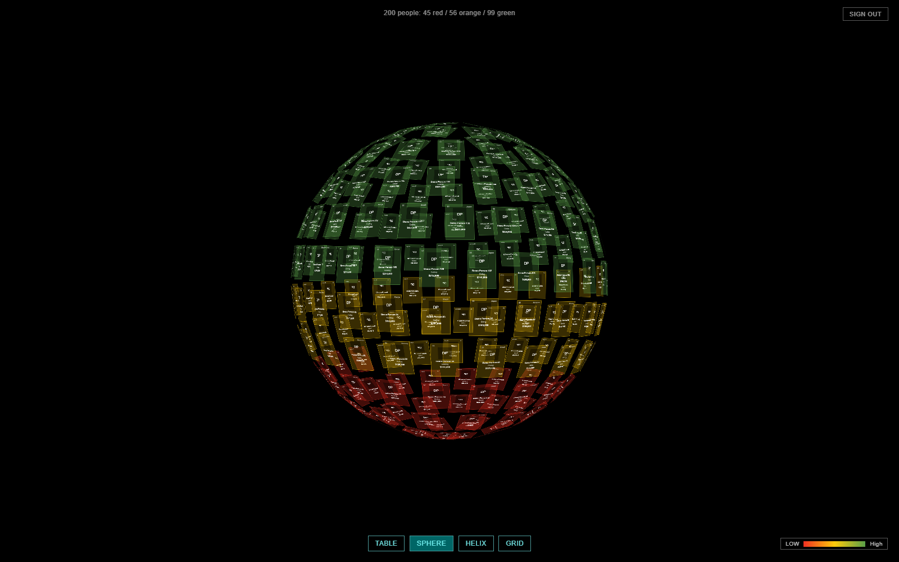
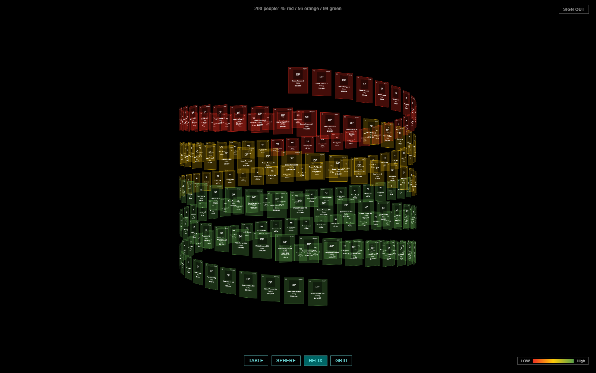
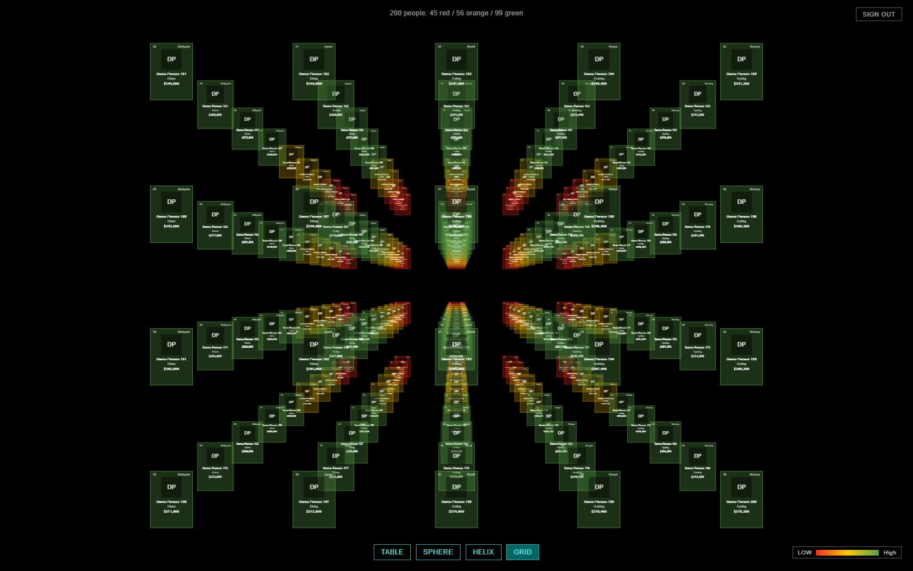
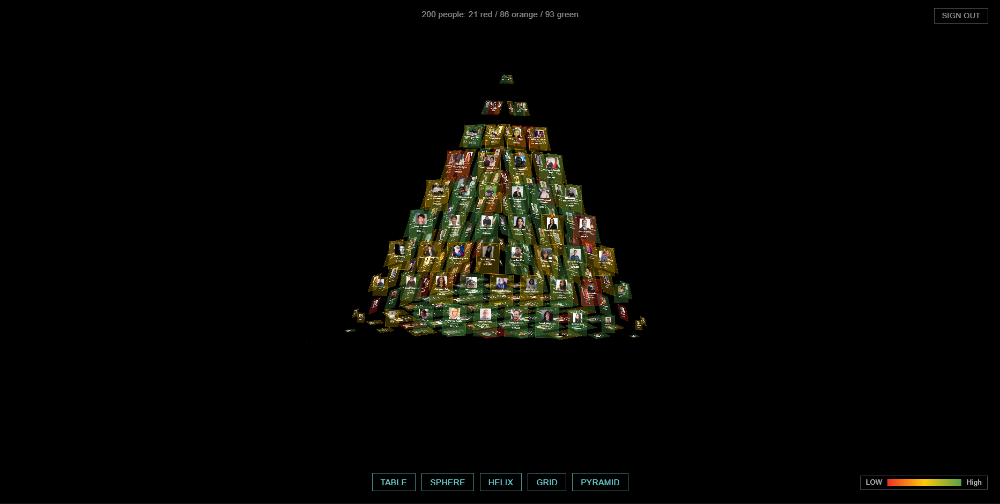
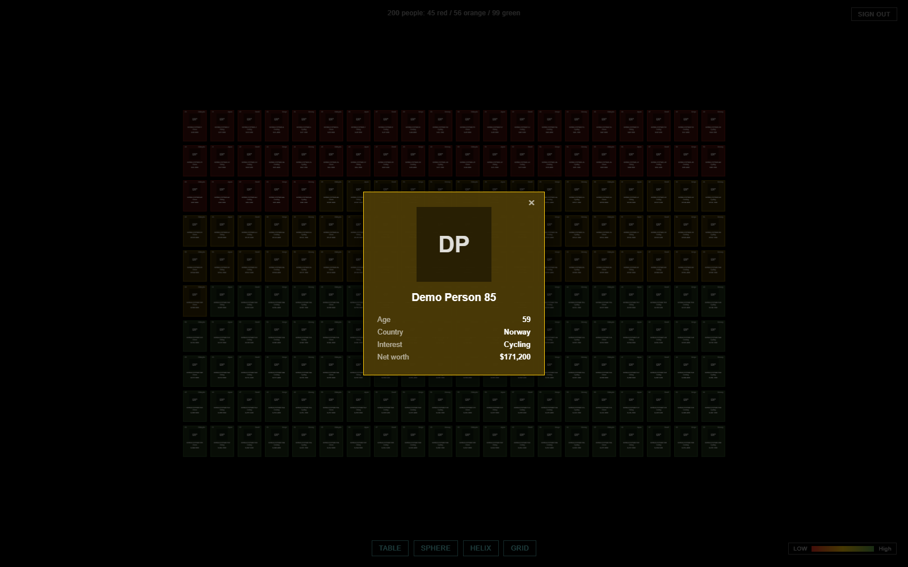

# Kasatria Assignment

A fork of the [three.js CSS3D periodic table demo](https://threejs.org/examples/#css3d_periodictable) that renders 200 people pulled live from a Google Sheet instead of chemical elements. Tiles are coloured by net worth and can be rearranged into five 3D layouts.

**Live:** https://kasatria-assignment-tau.vercel.app

Sign-in is limited to Google accounts registered as test users on the OAuth consent screen. See [Access](#access) below.

---

## Screenshots

Most shots below use the local demo dataset, so the photos fall back to initials and the colour counts differ from the real sheet. The pyramid shot is of the real sheet.

### Sign in



### Table, 20 x 10

Ten rows of twenty, filled in sheet order, left to right and top to bottom.



### Sphere

Points distributed evenly over a sphere of radius 800, each tile turned to face outward.



### Helix, double

People alternate between two strands half a turn apart, so each pair sits at the same height on opposite sides of the axis.



### Grid, 5 x 4 x 10

Five wide, four high, ten layers deep. 200 people fill it exactly.



### Pyramid, 4 faces

A regular tetrahedron, apex up, 50 people on each triangular face. Tiles shrink as they approach a corner of their face, where a full-size rectangle would overhang both edges.



### Tile detail

Clicking a tile grows a card out of that tile's on-screen position and shrinks it back on close.



---

## What it does

1. Google sign-in through Google Identity Services, token model, browser only.
2. Fetches the sheet with the Sheets API v4 using the granted access token. The tab name is resolved at runtime, so renaming the tab does not break the app.
3. Parses 200 rows into person records, converting the quoted net worth string such as `"$251,260.80"` into a number.
4. Builds one CSS3D tile per person showing photo, name, age, country, interest and net worth. Missing photos fall back to initials.
5. Colours each tile by net worth: red below $100,000, orange from $100,000 to $200,000, green above $200,000. On the real dataset that is 21 red, 86 orange, 93 green.
6. Switches between the five layouts with tweened transitions. Drag to orbit, scroll to zoom.
7. Clicking a tile opens a detail card. Sign out asks for confirmation first, then returns to the sign-in screen so a different account can be picked.

---

## Stack

- Vite, vanilla JavaScript, no framework
- three.js with `CSS3DRenderer` and `TrackballControls`
- `@tweenjs/tween.js` for layout transitions
- Google Identity Services for sign-in
- Google Sheets API v4 for the data
- Vercel for hosting

No backend. Everything runs in the browser.

---

## Running locally

```bash
npm install
npm run dev
```

Then open http://localhost:5173.

### Demo mode, no Google account needed

```
http://localhost:5173/?demo
```

Loads 200 generated people through the same code path, so the scene, the layouts, the detail card and the sign-out flow can be exercised without signing in. The branch is gated behind `import.meta.env.DEV`, so it is dropped from production builds.

### Environment variables

Vite only exposes variables prefixed with `VITE_`. Create a `.env` file in the project root:

```
VITE_GOOGLE_CLIENT_ID=<your-oauth-client-id>
VITE_SHEET_ID=<your-sheet-id>
VITE_SHEET_RANGE=A1:F201
```

`VITE_SHEET_RANGE` holds only the A1 part. Any tab prefix is stripped, because the tab title is looked up at runtime.

`.env` is gitignored. The same three variables must be set in the Vercel project, and Vercel only applies them to new builds, so redeploy after changing one.

---

## Layout geometry

All five are computed in `src/layouts.js`. The first four are the ones the brief asks for; the pyramid is an addition.

| Layout | Shape | Notes |
|---|---|---|
| Table | 20 columns x 10 rows, flat | Position derived from the index, not from hardcoded periodic-table coordinates |
| Sphere | radius 800 | Unchanged from the demo |
| Helix | double, two strands | `i % 2` picks the strand, the second is offset by `Math.PI` |
| Grid | 5 wide x 4 high x 10 deep | Demo default is 5 x 5 x 5 |
| Pyramid | regular tetrahedron, 4 faces x 50 | Bowling-pin rows per face, tiles scaled down near the corners |

### How the pyramid is built

1. Four vertices: three base corners on a circle plus an apex, centred on the origin so the shape sits where the other layouts do. Edge length 1700 leaves roughly 160 between neighbours in both directions, which clears the 120 x 160 tile.
2. The 200 people are split evenly over the four faces, 50 each.
3. Within a face the tiles fill bowling-pin rows, row `r` holding `r + 1` tiles. 50 is not a triangular number, so the builder takes as many whole rows as fit (9, holding 45) and spreads the 5 left over across them in proportion to row width. That keeps the spacing even instead of leaving a ragged final row.
4. Each face gets its own basis, built from its edge direction and its outward normal, so tiles lie flat on the face and read from outside. Winding is checked against the centre and corrected per face, so no face ends up inside out.
5. Tiles are rectangles, so a full-size one at a triangle corner overhangs both edges. Scale falls off with nearness to the nearest corner, from 1.0 down to 0.3, which is what gives the faces their tapered tips. Carrying that needed `transform()` in `scene.js` to tween scale alongside position and rotation; the other layouts leave their targets at the default 1, so switching away restores full size.

### Verifying the geometry

```bash
node layout-check.mjs
```

Asserts the parts that are easy to break and hard to eyeball: the table is exactly 20 by 10 and flat, the grid is exactly 5 by 4 by 10 with no duplicate slots, both helix strands hold 100 people at matching heights on opposite sides of the axis, every sphere point sits on radius 800, and the pyramid fills 200 slots across exactly four facings of 50 with every tile inside the hull and scaled between 0.3 and 1. Run it after any change to `layouts.js`.

---

## Project structure

```
index.html
layout-check.mjs        geometry assertions
docs/screenshots/       images used by this README
src/
  main.js               entry, wires auth to fetch to scene
  auth.js               Google Identity Services sign-in and sign-out
  sheets.js             Sheets API fetch, tab resolution, row parsing
  tile.js               builds one CSS3D tile from a person
  detail.js             tile detail pop-out card
  layouts.js            table, sphere, helix, grid and pyramid position maths
  scene.js              three.js scene, renderer, controls, transitions
  demoData.js           dev-only generated dataset
  style.css
```

---

## Access

The OAuth consent screen is deliberately left in Testing mode. `spreadsheets.readonly` is a sensitive scope, and publishing would trigger a Google verification review that takes weeks. The practical consequences:

- Only accounts added as test users can sign in. Any other account sees an "app is blocked" message. That is expected, not a fault.
- Only the production origin is registered with the OAuth client. Vercel preview deployments have their own hostnames, so sign-in fails there. Test sign-in against the production URL.

---

## Notes

- 200 tiles means 200 real DOM elements, since `CSS3DRenderer` positions HTML rather than drawing to a canvas. Tile markup is kept lean for that reason.
- `TrackballControls` calls `setPointerCapture` on the renderer element, which retargets `pointerup` away from the tile that was clicked. Tile clicks are resolved with `document.elementFromPoint` on the release point instead of the event target. Synthetic clicks do not reproduce the original problem, so any future check has to be done with a real mouse.
- `TROUBLESHOOTING.md` has the longer write-ups for the problems that took real time to work out.
